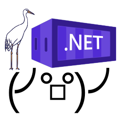

# konet.crane



Small wrapper around [crane](https://github.com/google/go-containerregistry/tree/main/cmd/crane) to generate a C library 
which can be used by [konet](https://github.com/lippertmarkus/konet).

## Compile on Linux 

```bash
# Windows DLL
GOOS=windows GOARCH=amd64 CGO_ENABLED=1 CC=x86_64-w64-mingw32-gcc go build -buildmode=c-shared -o crane.dll main.go

# Linux lib
go build -buildmode=c-shared -o crane.dll.so main.go
```

## Create NuGet Package

```bash
nuget pack Package.nuspec
```
